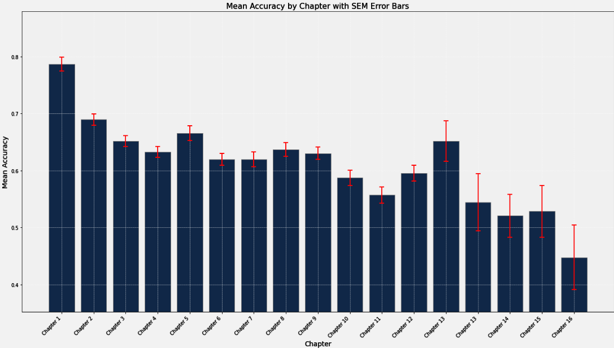

# DataFest 2024 ReadMe

# Table of Contents
- Introduction
- The Task
- The Data
- Our Goal
- Data Challenges
- Project Approach
    - Difficulty Across Chapters
        - Recommendations
    - Relationship Between Section Responses and Checkpoint Responses
        - Recommendations
    - Attempt vs. Accuracy
        - Recommendations
    - Behavior and Performance
        - Recommendations
    - Network Analysis
        - Recommendations
- Future Directions
- Conclusion

# Introduction

This project was undertaken for the Duke DataFest 2024 Competition. DataFest is a data analysis competition hosted by the American Statistical Association where teams analyze a surprise data set over the course of a weekend to extract interesting insights. Myself and four other Duke students collaborated to tackle the challenges presented by this competition.

# The Task

The central topic for this competition was the analysis of student usage data from CourseKata, a platform that creates and publishes a series of e-books for introductory statistics and data science classes. We were tasked to examine data given to us by CourseKata to make suggestions to improve the student experience of learning statistics.

# The Data

The data was collected in 48 college-level introductory statistics and data science classes
taught in 11 different college institutions in 2023. Each of these classes used one of the CourseKata
textbooks. The data are from a total of 1625 students who allowed for their anonymized data
to be used towards improving the textbook. The data were divided into 5 files.

1. page_views: This data file represents student's access to a particular page within a chapter such as date and time accessed, student engagement, and page content.
2. responses: This file provides information on student's response and supplementary data about in-chapter textbook questions such as question prompt, student response, and student score.
3. items: This file contains information on textbook questions such as question location, question type, and question solution.
4. media_views: This file consists of information about a student’s interaction with a video such as length, duration watched, and video identifier.
5. checkpoints: This file represents a student’s response to either a “pulse” (psychological state of mind) question and information on end-of-chapter review questions for the relevant chapter such as percent correct, total questions, and number of attempts.

Data from CourseKata are proprietary and are not allowed to be made public. 

# Our Goal

Our objective was to use the data to identify core problems with textbook design, and offer tangible data-driven solutions to these problems. We aimed to explore various aspects such as student engagement patterns, chapter difficulties, student psychology, and textbook layout to offer actionable insights.

# Data Challenges

One challenge we encountered was the presence of missing values in several columns. Due to the time-sensitive nature of this competition, we opted to address this challenge by removing rows with missing data.

# Project Approach

The following sections describe various avenues of the data we explored, and are followed by recommendations to CourseKata and educators based on insights derived from the data.

## Difficult Across Chapters

Our initial focus was to assess the difficulty level of each chapter and explore potential trends in chapter difficulty throughout the textbook. We computed the mean accuracy of end-of-chapter exams, the results of which are depicted here: 



Subsequently, to ascertain the statistical significance of these findings, we conducted linear regression analysis comparing chapter difficulty to end-of-chapter scores, as illustrated in Image2


Additionally, we visualized the distribution of end-of-chapter scores for each chapter using kernel density estimation plots, as shown in Image3


### Recommendations

Understanding these patterns holds significant implications for CourseKata and educators alike. By discerning areas where students encounter challenges, teachers can fine-tune their instructional approach to optimize learning outcomes. Notably, our analysis revealed that performance tends to decline as students progress through chapters. This insight suggests the need for educators to allocate instructional time efficiently, focusing less on review material and basics, content that students either already know or have any easier time grasping, and dedicating more time to challenging topics.

Furthermore, upon closer examination of the data, specific chapters emerged as particularly challenging or easier than anticipated. For instance, Chapter 11 exhibited notably lower mean accuracy compared to surrounding chapters, indicating a potential need for additional classroom instruction or enhancements to the corresponding textbook section. Conversely, Chapter 13 appeared easier relative to neighboring chapters, suggesting an opportunity for reallocating instructional time to prioritize more challenging material, such as Chapter 11.

Moreover, the widening distribution of end-of-chapter scores as students progress through the course underscores the diverse range of student abilities. This variability presents a challenge, but, by knowing this, teachers can adapt by implementing differentiated instruction strategies later into the course to accommodate diverse learning needs and provide targeted support to students who may be struggling.

## Relationship Between Section Responses and Checkpoint Responses

At the end of each section, the textbook prompted students to rate four checkpoint statements on a scale of 1 to 6, gauging their confidence and understanding of the content just covered. These statements included: “I am confident in what I have learned in the previous chapter”, “I was unable to put in the time needed to do well in the previous chapter”, “My statistics ability is something about me that I can’t change very much”, and “I think what I have learned in the previous chapter is useful.” We then analyzed each student's response to these questions in relation to their performance on end-of-chapter exams, as depicted in the following images:


Our analysis revealed a clear relationship, albeit not for all questions. Notably, questions regarding students' confidence levels and the perceived usefulness of the content emerged as the most predictive of end-of-chapter exam scores.

### Recommendations

Understanding students' mindsets holds paramount importance for enhancing textbook design and overall classroom effectiveness. The perception of content usefulness is particularly noteworthy, as it informs CourseKata's efforts to enhance relevance and real-world applicability. By demonstrating practical relevance and aligning content with student interests, CourseKata can foster deeper engagement and comprehension.

Additionally, the significant influence of students' confidence levels on exam performance underscores the importance of fostering a supportive learning environment. Cultivating student confidence through targeted interventions and personalized support can positively impact academic outcomes and promote a growth mindset among learners.

## Attempt vs. Accuracy

Our investigation delved into the relationship between the number of attempts on in-section or end-of-section tests and the probability of answering questions correctly. Surprisingly, we discovered that as students attempted a question more frequently, their probability of success decreased. This trend, aggregated across all chapters, is illustrated in image4.


### Recommendations

This finding is interesting, because it’s counterintuitive to what one might expect. While it may seem intuitive that repeated attempts would lead to improved performance, our results suggest otherwise. One plausible explanation is that students may not effectively analyze why they initially answered a question incorrectly, instead resorting to indiscriminate attempts to arrive at the correct answer quickly.

Knowing this, we propose several solutions to CourseKata.  Firstly, measures could be implemented to discourage excessive attempts, such as the introduction of cooldown timers. These timers would encourage students to pause and revisit chapter content, fostering deeper understanding and reflection. Additionally, integrating hyperlinks to relevant content within the textbook would facilitate easy access to supplementary material, aiding students in revisiting and reinforcing key concepts. Additionally, CourseKata could consider implementing hints for students who continue to struggle after a certain number of unsuccessful attempts.

## Behavior and Performance

Our investigation shifted towards examining the linearity of student paths through the textbook, probing whether students adhered strictly to the suggested sequence or navigated more flexibly. We sought to determine if the linearity of a student's progression had any effect on their performance.

Initially, we analyzed the aggregate frequency of visits to each chapter, aiming to uncover any notable patterns. As anticipated, the number of visits to subsequent sections decreased, mirroring the sequential nature of the textbook. However, the necessity to revisit previous materials underscored the interconnectedness of the content.


Next, we quantified the linearity of students' paths by calculating its entropy. To do this, we used the formula for conditional entropy: the negative sum of conditional probabilities multiplied by the logarithm of those probabilities. We then computed the joint entropy, which reflects the degree of non-linearity in their traversal through the textbook. The following code snippet illustrates this process: 

```jsx
# Helper function to calculate conditional probabilities and conditional entropy
def calculate_conditional_entropy(access_sequence):
    # Count transitions
    transitions = pd.Series(list(zip(access_sequence, access_sequence[1:]))).value_counts()
    total_transitions = transitions.sum()
    
    # Calculate conditional probabilities P(Y|X)
    conditional_probs = transitions / total_transitions
    
    # Calculate conditional entropy H(Y|X)
    conditional_entropy = -np.sum(conditional_probs * np.log2(conditional_probs))
    
    return conditional_entropy
    
# Calculate joint entropy for each student
joint_entropy = {}
for student_id, group in page_views_df_sorted.groupby('student_id'):
    # Extract the chapter_section sequence for the current student
    access_sequence = group['chapter_section'].tolist()
    
    # Ensure there's at least one transition to calculate conditional entropy
    if len(access_sequence) > 1:
        joint_entropy[student_id] = calculate_conditional_entropy(access_sequence)
    else:
        joint_entropy[student_id] = 0  # Assign 0 entropy for single access, implying no uncertainty
```

Calculating the joint entropy for each student, which gauges the non-linearity of their textbook traversal, enabled us to graph the mean accuracy of students on the end-of-chapter review sections against their entropy score. These insightful results are depicted below:


Regression analysis of these results indicates a positive relationship between joint entropy and student performance.

### Recommendations

Our exploration into entropy uncovers an intriguing revelation: a linear progression through the textbook may not be optimal for students. Instead, our findings suggest that students who engage in non-linear navigation, characterized by revisiting previous content and making interdisciplinary connections, tend to perform better on quizzes. This phenomenon could be attributed to students' inclination to revisit and reinforce understanding, as well as their ability to contextualize knowledge across chapters.

Based on these findings, we can recommend that CourseKata encourage students to adopt a non-linear approach to navigation. This could involve implementing features such as hyperlinks between chapters to facilitate seamless exploration or integrating recommendation systems that suggests related chapters based on the student’s current progress and performance.

## Network Analysis

After this, we were interested in visualizing student paths through the textbook using network analysis, aiming to determine relationships between nodes and edges. The code snippet below illustrates this process:

```jsx
# Select a specific student's data
student_id = 'b9b1abc2-8934-4468-af82-68fc14534784'  # Example student ID
student_data = page_views_df[page_views_df['student_id'] == student_id].copy()
student_data = student_data.sort_values(by='dt_accessed')

# Create a Directed Graph
G = nx.DiGraph()
G.add_nodes_from(student_data['chapter_section'].unique())
for i in range(len(student_data) - 1):
    source = student_data.iloc[i]['chapter_section']
    target = student_data.iloc[i + 1]['chapter_section']
    if G.has_edge(source, target):
        G[source][target]['weight'] += 1
    else:
        G.add_edge(source, target, weight=1)

# Layout
pos = nx.kamada_kawai_layout(G)

# Nodes: Color and Size
node_color = ['gold' if node == student_data['chapter_section'].iloc[0] else 'lightgreen' for node in G]
node_size = [G.degree(node) * 500 + 500 for node in G]

# Edges: Color and Width
edge_color = ['black' if G[u][v]['weight'] > 1 else 'black' for u, v in G.edges()]
edge_width = [G[u][v]['weight'] * 1.5 for u, v in G.edges()]

plt.figure(figsize=(24, 24))
nx.draw(G, pos, with_labels=True, node_color=node_color, node_size=node_size, 
        edge_color=edge_color, width=edge_width, font_size=22, arrowsize=20)

plt.title(f"Enhanced Viewing Path of Student {student_id}", fontsize=20)
plt.axis('off')  # Turn off the axis
plt.show()
```

The resulting visualizations, like the one shown below, offer insights into student navigation through the textbook:


In this image, the golden node represents the textbook section the student started at, each node represents a unique chapter section, and node size indicates visit frequency. Edges signify directed transitions between sections, while edge thickness reflects traversal frequency.

While fascinating, individual student traversals provide limited insight for CourseKata recommendations. Therefore, we further analyzed aggregate chapter section data. Initially, we examined the aggregate number of indegrees each chapter section received, as depicted in Image9.


The graph illustrates the chapters that students revisit most frequently, suggesting the relevance and significance of certain content within the textbook. Such revisits may indicate critical concepts that students either forget or require reinforcement, particularly as they progress through subsequent chapters.

We also analyzed the occurrence of loops within chapter sections, where a loop indicates a student's immediate return to the previously completed section. The following images offer a comprehensive overview of all chapter sections and the top 20 sections with the highest loop occurrences, respectively.


### Recommendations

Our examination of chapters with the most indegrees offers valuable insights for educators and CourseKata. These heavily revisited chapters likely contain pivotal content essential for understanding subsequent material. For example, Chapter 4.3, titled "Outcome and Explanatory Variables," stands out with a significant number of indegrees. Given the likelihood of future content building upon this chapter, educators could integrate refresher content later in the curriculum to reinforce essential concepts introduced earlier. Additionally, CourseKata might consider redesigning the textbook to include refresher content or hyperlinks in sections frequently revisited by students, thereby facilitating navigation and reinforcing key concepts.

Additionally, another interesting finding involved the frequency of loops observed for each section. A high occurrence of loops suggests that students may have encountered confusion or difficulty comprehending the content during their initial study session, prompting them to revisit the material by reading or watching the videos again. Notable chapters exhibiting this pattern include:

11.2 – Sampling Distributions of PRE and F 

4.2 – Explaining one Variable with Another 

12.1 – From Hypothesis Testing to Confidence Intervals 

1.5  – Save your Work in R Objects 

9.1 – Using a Quantitative Explanatory Variable

Identifying these challenging or pivotal chapters is essential for optimizing instructional strategies and resource allocation. By allocating more class time to address these areas or restructuring textbook sections to enhance clarity, educators and CourseKata can better support student learning and improve overall comprehension.

# Future Directions

Another avenue to explore involves investigating potential correlations between chapter attributes, such as length, inclusion of images and videos, and types of questions, with the frequency of loops observed. This analysis could unveil insights into the ideal chapter structure that facilitates comprehensive understanding of the material by students.

# Conclusion

In conclusion, our analysis of student usage data from CourseKata for the Duke DataFest 2024 Competition unveiled several key insights with significant implications for textbook design and instructional strategies. We identified trends in chapter difficulty, student engagement, and navigation patterns, offering actionable recommendations for CourseKata and educators. Notably, we found that as students progress through chapters, their performance tends to decline, suggesting the need for more targeted instruction on challenging topics. Additionally, students who engage in non-linear navigation tend to perform better on quizzes, indicating the importance of fostering exploration and interdisciplinary connections. Recommendations include encouraging non-linear navigation, integrating refresher content in heavily revisited chapters, and addressing areas of confusion identified through loop occurrences. Moving forward, exploring correlations between chapter attributes and student engagement could further enhance our understanding of effective textbook design and instructional practices.
